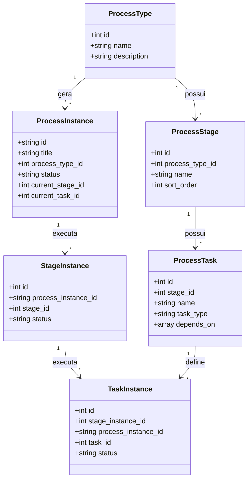

# Estrutura do Projeto e Modelo de Domínio

Esta seção descreve a arquitetura conceitual da **PI\*VMA** (Plataforma de Validação de Métodos para o BraCVAM), detalhando como o fluxo de processos é configurado e instanciado.

---

## Modelo Conceitual: Configuração vs. Execução

A arquitetura do sistema baseia-se em uma separação clara entre as **Configurações/Definições** (metadados estruturais do fluxo) e a **Execução** (instâncias reais de fluxo criadas pelos usuários).

---

## A Tríade: Processo - Etapa - Tarefa

O ciclo de vida de uma submissão de validação é modelado em três níveis hierárquicos:

### 1. Processo (`ProcessType` & `ProcessInstance`)
Representa o fluxo completo de validação técnica de um método alternativo.
- **Configuração**: [process_types.json](file:///home/meirelesgc/Projects/BraCVAM/pivma/src/data/mock/process_types.json) define os fluxos disponíveis (ex: *Método 100% novo*, *Nova aplicação*).
- **Execução**: [process_instances.json](file:///home/meirelesgc/Projects/BraCVAM/pivma/src/data/mock/process_instances.json) registra cada instância ativa iniciada por um proponente (ex: ID `BRA-2026-005`), contendo o status global (`active`, `completed`) e ponteiros para a etapa e tarefa correntes.

### 2. Etapa (`ProcessStage` & `StageInstance`)
Divide o processo em fases lógicas e sequenciais que possuem dependências de conclusão.
- **Configuração**: [process_stages.json](file:///home/meirelesgc/Projects/BraCVAM/pivma/src/data/mock/process_stages.json) define as etapas associadas a cada tipo de processo, com ordenação (`sort_order`). As etapas padrão são:
  1. *Submissão e Triagem*
  2. *Planejamento*
  3. *Execução da Validação*
  4. *Revisão e Decisão*
- **Execução**: [stage_instances.json](file:///home/meirelesgc/Projects/BraCVAM/pivma/src/data/mock/stage_instances.json) rastreia o andamento de cada fase do processo (`active`, `completed`), com datas de início e conclusão.

### 3. Tarefa (`ProcessTask` & `TaskInstance`)
A unidade fundamental de trabalho onde a interação com o usuário acontece. Cada tarefa tem um tipo específico, regras de acesso baseadas em papéis e pode depender de outras tarefas anteriores.
- **Configuração**: [process_tasks.json](file:///home/meirelesgc/Projects/BraCVAM/pivma/src/data/mock/process_tasks.json) detalha os requisitos da tarefa (editor, visualizador, aprovador, prazos de entrega e dependências).
- **Execução**: [task_instances.json](file:///home/meirelesgc/Projects/BraCVAM/pivma/src/data/mock/task_instances.json) gerencia o estado da tarefa em execução:
  - `locked`: Bloqueada até que as tarefas de dependência declaradas em `depends_on` sejam concluídas.
  - `pending` / `in_progress`: Disponível para preenchimento ou edição.
  - `awaiting_approval`: Enviada pelo editor e aguardando aprovação técnica.
  - `completed`: Concluída com sucesso.
  - `rejected`: Devolvida pelo aprovador para ajustes do editor.

---

## Papéis e Controle de Acesso

A segurança e os privilégios de edição/aprovação são controlados dinamicamente em nível de tarefa:
- **Definição de Papéis**: Declarada em [process_roles.json](file:///home/meirelesgc/Projects/BraCVAM/pivma/src/data/mock/process_roles.json). Os papéis incluem *Proponente*, *Patrocinador*, *Grupo Gestor*, *Coordenador do Grupo Gestor*, *Laboratório Líder*, *Estatístico*, *Especialista Temático* e *BraCVAM*.
- **Participantes**: Mapeados em [process_participants.json](file:///home/meirelesgc/Projects/BraCVAM/pivma/src/data/mock/process_participants.json) por instância de processo.
- **Controle por Tarefa**: A configuração de cada tarefa define explicitamente quais cargos têm permissão para:
  - `viewer_roles`: Visualizar os dados.
  - `editor_roles`: Modificar e submeter os dados da tarefa.
  - `approver_roles`: Aprovar ou recusar o envio.

---

## Orquestração do Fluxo de Trabalho (Workflow Services)

Toda a lógica de transição de estados e regras de negócios está isolada em serviços dedicados no diretório [src/mockDb/services](file:///home/meirelesgc/Projects/BraCVAM/pivma/src/mockDb/services):

### [processService.js](file:///home/meirelesgc/Projects/BraCVAM/pivma/src/mockDb/services/processService.js)
Responsável pelas operações de nível macro do processo:
- **Criação de Processo**: Inicializa a instância, adiciona o proponente original, cria a primeira instância de etapa (`StageInstance` ativa) e gera as instâncias de tarefas (`TaskInstance`s) dessa primeira etapa. Apenas a primeira tarefa é marcada como `pending`, enquanto as demais iniciam como `locked`.

### [taskService.js](file:///home/meirelesgc/Projects/BraCVAM/pivma/src/mockDb/services/taskService.js)
Gerencia a persistência de respostas e estados específicos de cada tarefa:
- Salva formulários ([formResponses.json](file:///home/meirelesgc/Projects/BraCVAM/pivma/src/data/mock/form_responses.json)).
- Registra metadados de arquivos submetidos ([uploaded_documents.json](file:///home/meirelesgc/Projects/BraCVAM/pivma/src/data/mock/uploaded_documents.json)).

### [workflowService.js](file:///home/meirelesgc/Projects/BraCVAM/pivma/src/mockDb/services/workflowService.js)
O core engine do fluxo de validação. Ele intercepta as conclusões de tarefas e atualiza o estado geral do fluxo:
1. **Desbloqueio de Tarefas**: Após uma tarefa ser concluída, analisa todas as outras tarefas da mesma etapa marcadas como `locked`. Se todas as dependências especificadas no array `depends_on` daquela tarefa estiverem com status `completed`, ela é destravada para `pending`.
2. **Definição de Tarefa Ativa**: Ajusta a propriedade `current_task_id` da instância do processo para apontar para a próxima tarefa disponível.
3. **Transição de Etapas**: Se todas as tarefas da etapa atual forem concluídas, o serviço marca a etapa atual como `completed`, cria uma instância para a próxima etapa (`StageInstance` ativa) e instancia todas as suas tarefas iniciais correspondentes.
4. **Encerramento**: Quando a última tarefa da última etapa é concluída, o status do processo é modificado para `completed`.

> [!NOTE]
> Essa lógica de desacoplamento permite que novos fluxos de validação sejam facilmente configurados alterando apenas a modelagem JSON em [src/data/mock](file:///home/meirelesgc/Projects/BraCVAM/pivma/src/data/mock).
